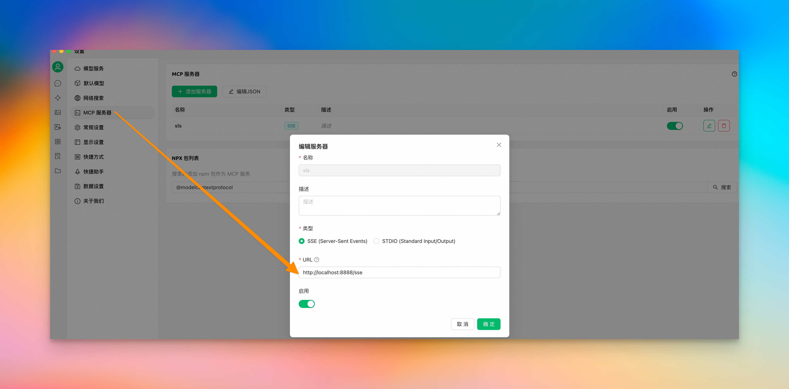
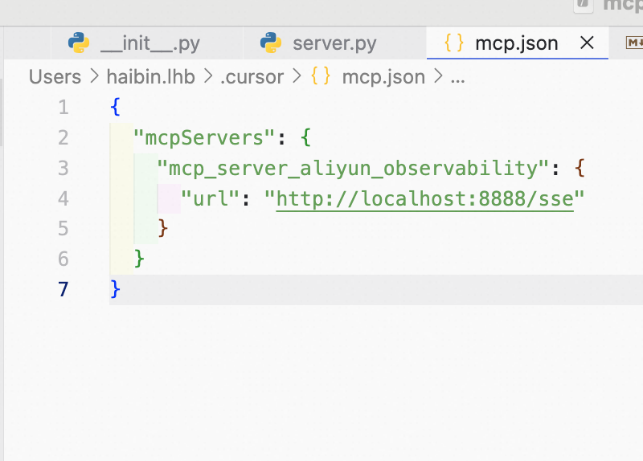
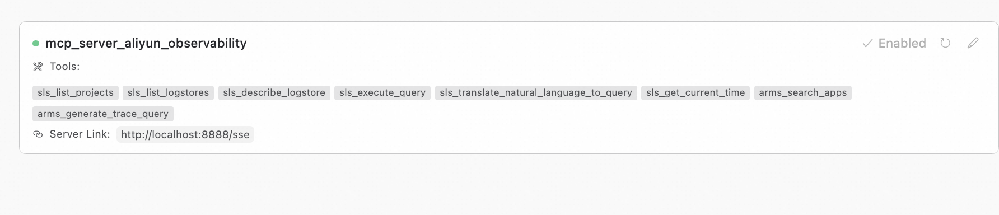
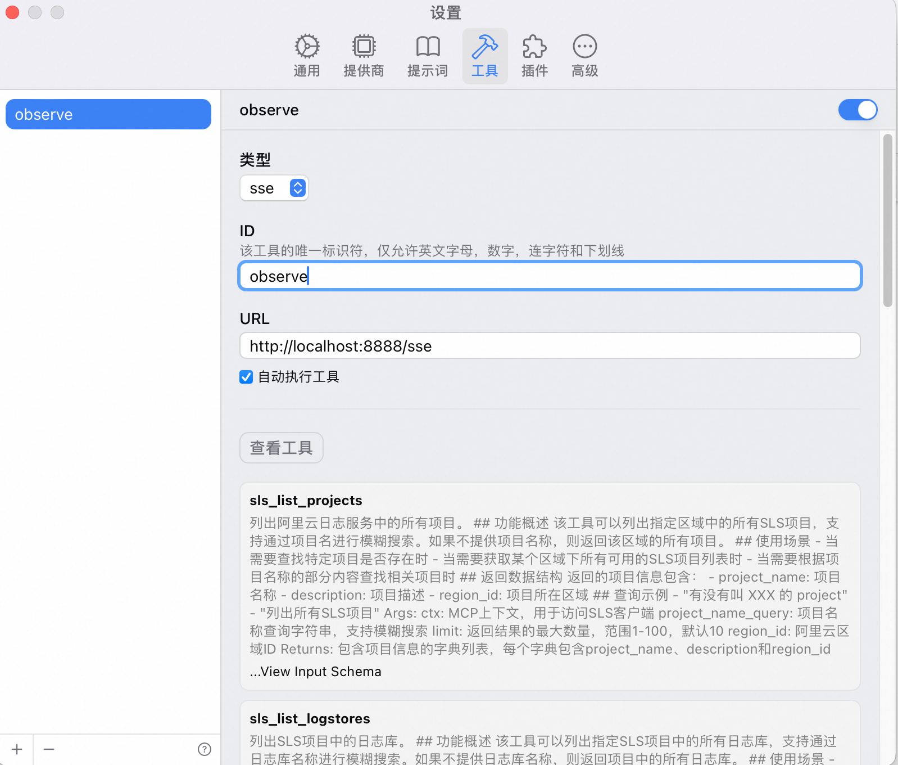
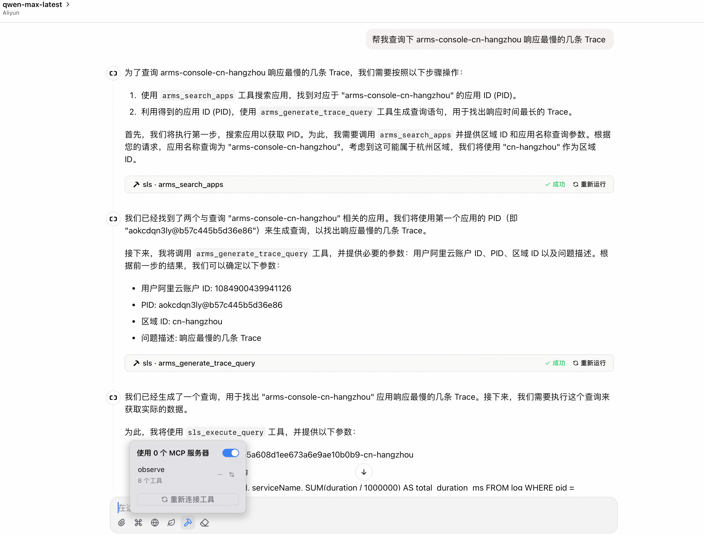

## Alibaba Cloud Observability MCP Server

### Introduction

Alibaba Cloud Observability MCP Server provides a set of tools for accessing various products in Alibaba Cloud's observability suite. It covers products including Alibaba Cloud Log Service (SLS), Alibaba Cloud Application Real-Time Monitoring Service (ARMS), and Alibaba Cloud CloudMonitor. Any intelligent agent that supports the MCP protocol can quickly integrate with it. Supported products include:

- [Alibaba Cloud Log Service (SLS)](https://www.alibabacloud.com/help/en/sls/product-overview/what-is-log-service)
- [Alibaba Cloud Application Real-Time Monitoring Service (ARMS)](https://www.alibabacloud.com/help/en/arms)

Currently, the MCP tools primarily focus on Alibaba Cloud Log Service, with support for other products being added incrementally. The detailed tools are as follows:

### Version History
You can check the [version history](./CAHANGELOG.md)

##### Example Scenarios

- Scenario 1: Quickly query the structure of a specific logstore
    - Tools used:
        - `sls_list_logstores`
        - `sls_describe_logstore`
    


- Scenario 2: Fuzzy query to find the application with the highest traffic in a logstore over the past day
    - Analysis:
        - Need to verify if the logstore exists
        - Get the logstore structure
        - Generate query statements based on requirements (users can confirm and modify statements)
        - Execute query statements
        - Generate responses based on query results
    - Tools used:
        - `sls_list_logstores`
        - `sls_describe_logstore`
        - `sls_translate_natural_language_to_query`
        - `sls_execute_query`
    

    
- Scenario 3: Query the slowest traces in an ARMS application
    - Analysis:
        - Need to verify if the application exists
        - Get the application structure
        - Generate query statements based on requirements (users can confirm and modify statements)
        - Execute query statements
        - Generate responses based on query results
    - Tools used:
        - `arms_search_apps`
        - `arms_generate_trace_query`
        - `sls_translate_natural_language_to_query`
        - `sls_execute_query`
    


### Permission Requirements

To ensure MCP Server can successfully access and operate your Alibaba Cloud observability resources, you need to configure the following permissions:

1.  **Alibaba Cloud Access Key (AccessKey)**:
    *   Service requires a valid Alibaba Cloud AccessKey ID and AccessKey Secret.
    *   To obtain and manage AccessKeys, refer to the [Alibaba Cloud AccessKey Management official documentation](https://www.alibabacloud.com/help/en/basics-for-beginners/latest/obtain-an-accesskey-pair).
  
2. When you initialize without providing AccessKey and AccessKey Secret, it will use the [Default Credential Chain for login](https://www.alibabacloud.com/help/en/sdk/developer-reference/v2-manage-python-access-credentials#62bf90d04dztq)
   1. If environment variables ALIBABA_CLOUD_ACCESS_KEY_ID and ALIBABA_CLOUD_ACCESS_KEY_SECRET exist and are non-empty, they will be used as default credentials.
   2. If ALIBABA_CLOUD_ACCESS_KEY_ID, ALIBABA_CLOUD_ACCESS_KEY_SECRET, and ALIBABA_CLOUD_SECURITY_TOKEN are all set, STS Token will be used as default credentials.
   
3.  **RAM Authorization (Important)**:
    *   The RAM user or role associated with the AccessKey **must** be granted the necessary permissions to access the relevant cloud services.
    *   **Strongly recommended to follow the "Principle of Least Privilege"**: Only grant the minimum set of permissions necessary to run the MCP tools you plan to use, to reduce security risks.
    *   Based on the tools you need to use, refer to the following documentation for permission configuration:
        *   **Log Service (SLS)**: If you need to use `sls_*` related tools, refer to [Log Service Permissions](https://www.alibabacloud.com/help/en/sls/user-guide/overview-2) and grant necessary read, query, and other permissions.
        *   **Application Real-Time Monitoring Service (ARMS)**: If you need to use `arms_*` related tools, refer to [ARMS Permissions](https://www.alibabacloud.com/help/en/arms/user-guide/manage-ram-permissions) and grant necessary query permissions.
    *   Please configure the required permissions in detail according to your actual application scenario.

### Security and Deployment Recommendations

Please pay attention to the following security issues and deployment best practices:

1.  **Key Security**:
    *   This MCP Server will use the AccessKey you provide to call Alibaba Cloud OpenAPI when running, but **will not store your AccessKey in any form**, nor will it be used for any other purpose beyond the designed functionality.

2.  **Access Control (Critical)**:
    *   When you choose to access the MCP Server through the **SSE (Server-Sent Events) protocol**, **you must take responsibility for access control and security protection of the service access point**.
    *   **Strongly recommended** to deploy the MCP Server in an **internal network or trusted environment**, such as your private VPC (Virtual Private Cloud), avoiding direct exposure to the public internet.
    *   The recommended deployment method is to use **Alibaba Cloud Function Compute (FC)** and configure its network settings to **VPC-only access** to achieve network-level isolation and security.
    *   **Note**: **Never** expose the MCP Server SSE endpoint configured with your AccessKey on the public internet without any identity verification or access control mechanisms, as this poses a high security risk.

### Usage Instructions


Before using the MCP Server, you need to obtain Alibaba Cloud's AccessKeyId and AccessKeySecret. Please refer to [Alibaba Cloud AccessKey Management](https://www.alibabacloud.com/help/en/basics-for-beginners/latest/obtain-an-accesskey-pair)


#### Install using pip
> ⚠️ Requires Python 3.10 or higher.

Simply install using pip:

```bash
pip install mcp-server-aliyun-observability
```
1. After installation, run directly with the following command:

```bash
python -m mcp_server_aliyun_observability --transport sse --access-key-id <your_access_key_id> --access-key-secret <your_access_key_secret>
```
You can pass specific parameters through the command line:
- `--transport` Specify the transport method, options are `sse` or `stdio`, default is `stdio`
- `--access-key-id` Specify Alibaba Cloud AccessKeyId, if not specified, ALIBABA_CLOUD_ACCESS_KEY_ID from environment variables will be used
- `--access-key-secret` Specify Alibaba Cloud AccessKeySecret, if not specified, ALIBABA_CLOUD_ACCESS_KEY_SECRET from environment variables will be used
- `--log-level` Specify log level, options are `DEBUG`, `INFO`, `WARNING`, `ERROR`, default is `INFO`
- `--transport-port` Specify transport port, default is `8000`, only effective when `--transport` is `sse`

2. Start using uv command
   
```bash
uv run mcp-server-aliyun-observability 
```
### Install from source code

```bash

# clone the source code
git clone git@github.com:aliyun/alibabacloud-observability-mcp-server.git
# enter the source directory
cd alibabacloud-observability-mcp-server
# install
pip install -e .
# run
python -m mcp_server_aliyun_observability --transport sse --access-key-id <your_access_key_id> --access-key-secret <your_access_key_secret>
```


### AI Tool Integration

> Taking SSE startup mode as an example, with transport port 8888. In actual use, you need to modify according to your specific situation.

#### Integration with Cursor, Cline, etc.
1. Using SSE startup method
```json
{
  "mcpServers": {
    "alibaba_cloud_observability": {
      "url": "http://localhost:7897/sse"
        }
  }
}
```
2. Using stdio startup method
   Start directly from the source code directory, note:
    1. Need to specify the `--directory` parameter to indicate the source code directory, preferably an absolute path
    2. The uv command should also use an absolute path; if using a virtual environment, you need to use the absolute path of the virtual environment
```json
{
  "mcpServers": {
    "alibaba_cloud_observability": {
      "command": "uv",
      "args": [
        "--directory",
        "/path/to/your/alibabacloud-observability-mcp-server",
        "run",
        "mcp-server-aliyun-observability"
      ],
      "env": {
        "ALIBABA_CLOUD_ACCESS_KEY_ID": "<your_access_key_id>",
        "ALIBABA_CLOUD_ACCESS_KEY_SECRET": "<your_access_key_secret>"
      }
    }
  }
}
```
3. Using stdio startup method - start from module
```json
{
  "mcpServers": {
    "alibaba_cloud_observability": {
      "command": "uv",
      "args": [
        "run",
        "mcp-server-aliyun-observability"
      ],
      "env": {
        "ALIBABA_CLOUD_ACCESS_KEY_ID": "<your_access_key_id>",
        "ALIBABA_CLOUD_ACCESS_KEY_SECRET": "<your_access_key_secret>"
      }
    }
  }
}
```

#### Cherry Studio Integration




#### Cursor Integration






#### ChatWise Integration



 