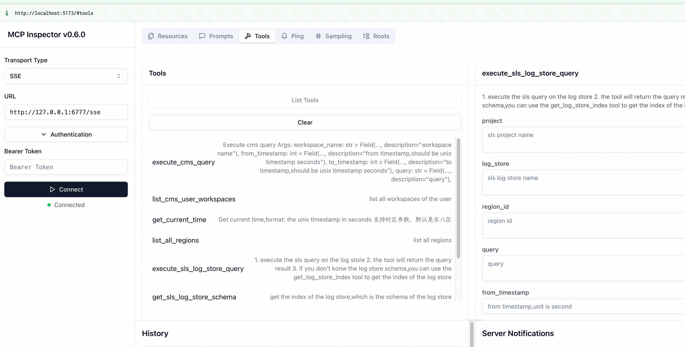

## how to contribute


### How to add new tools

1. Add the tool function to the `tools` folder
2. Add the @tool decorator to the tool function
3. Can use Field to define the input and output of the tool function
4. Can use Context to get the mcp context, for example the client of sls,arms,cms,etc.

### How to debug the tool

method 1:
you can just create a test case in the `test` folder, and run the test case.

method 2:
you can use the mcp npx tool to test the tool.
document: https://modelcontextprotocol.io/docs/tools/inspector

1. install npx
```bash
npm install -g npx
```

2. run the npx
```bash
npx @modelcontextprotocol/inspector
```
it will start a web server, you can test the tool by the web page.
3. start the mcp server if you direct run from the source code

```bash
python src/mcp_server_aliyun_observability/__init__.py --access-key-id xxx --access-key-secret xxx --log-level DEBUG --transport sse --transport-port 6777
```
4. then you can test the tool by the web page.




### how to deploy the mcp server to pip

1. build the package
```bash
python -m build
```
2. upload the package to pypi
```bash
python -m twine upload dist/*
```


